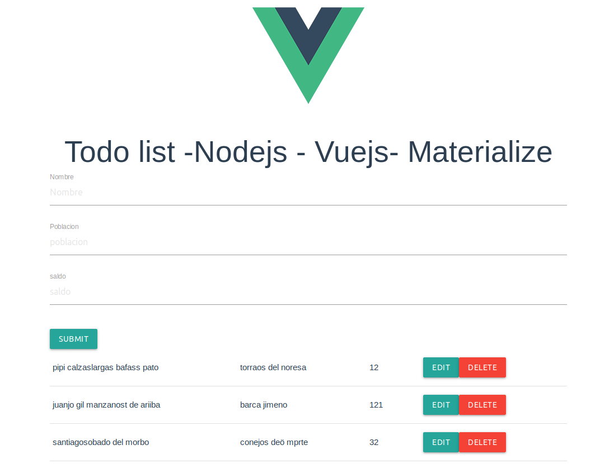

# nodejs-hbs-materialize
crud api/web con nodejs- handelbars (hbs) y materialize 1.0.0 (completo)

- Hay dos formas de acceso:
  * Una como api, mediante: myip:3000/api/(listado|crear|modificar|borrar|buscar).
     Ejemplo: myip:3000/api/modificar/11
  * Otra como web, mediante: myip:3000/users/listado
     Ejemplo: http://173.242.39.9:3000/users/listado
  * Y la otra es a traves de Vuejs con el puerto 8080 o el que te diga al ejecutar : 
     #crud-nodejs-vuejs-mysql-materialize#client#npm run serve
     Ejemplo: http://173.441.31.9:8080

Funcionamiento basico:
```ruby
mysql>CREATE DATABASE seq_db;
$ git clone https://github.com/josepereza/nodejs-crud-api-web-mariadb-materialize.git
$ cd nodejs-crud-api-web-mariadb-materialize
$mysql -u root -p seq_db < db.sql
//Tenemos que modificar los datos de acceso a mysql en:controllers/apicrud.js  y controllers/listado.js
$ npm install
$ npm start
```

Este proyecto lo hemos creado utiliando express-generator:

```ruby
$ npm install -g express-generator
$ express --hbs miapp
$ cd miapp
$ npm install


```

